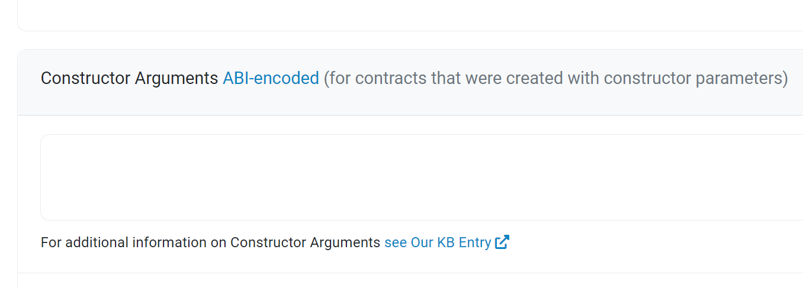

## Question 4
Does `Etherscan` require users to provide specific values for `constructor parameters` in `M4`;
## Answer 4

### Method

We deployed and verified the [test_temple](test_temple.sol)(as shown below) contract in different solidity version, which allowed us to confirm that `Etherscan` gives a special option for entering `constructor parameters` and the `parameter`'s length is required to conform to the general `ABI` encoding.
```solidity
contract A {
    constructor(bytes memory input){
    }
}
```



### Conclusion
Eventually we confirmed that `Etherscan` requires a user-supplied `constructor parameters`.